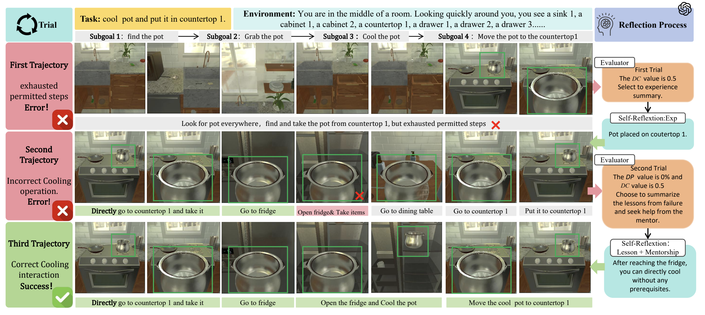
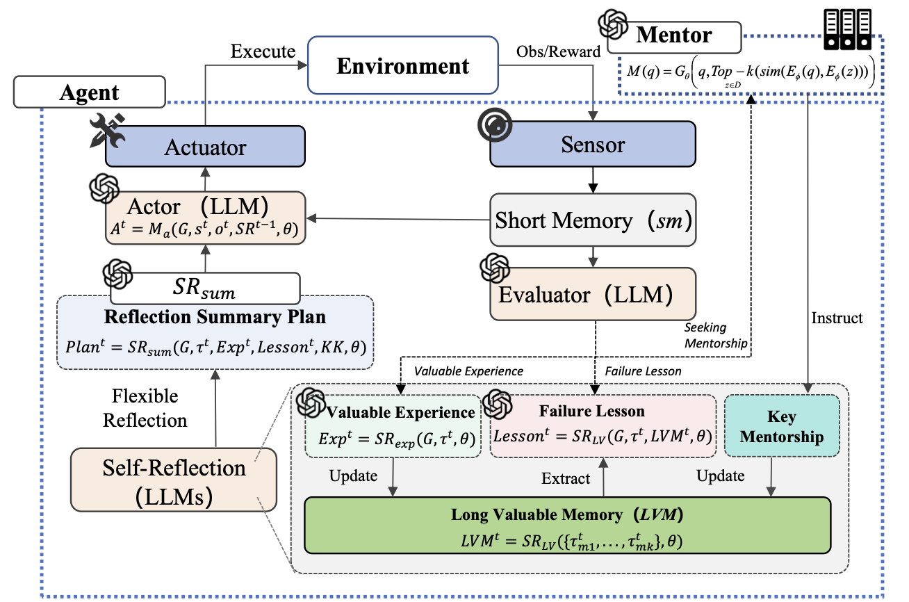
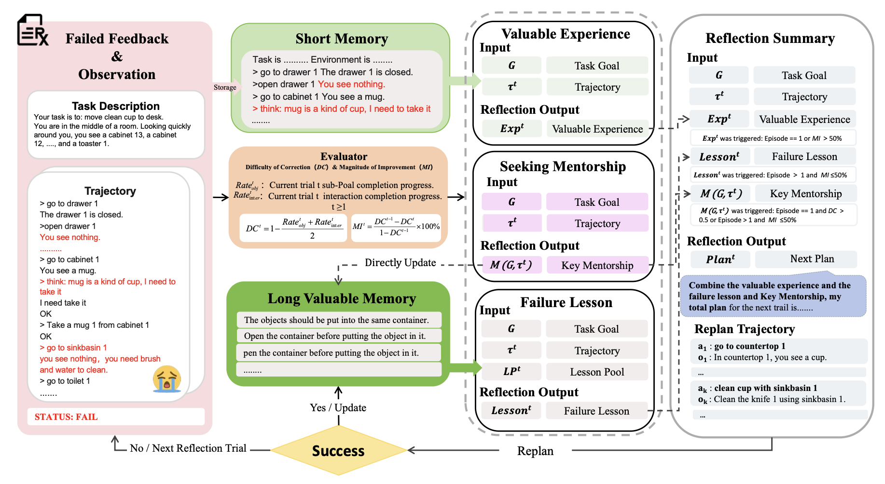

<!-- <h1 align="center"> Flexible Constructivism Reflection for Long-Horizon Robotic Task Planning with Large Language Models </h1> -->

<b>Code Availability Statement</b> 
The source code will be released upon acceptance of the paper.

<!--

  IROS 2025

<!--
[author1], [author2]
-->

## Abstract
Large language models (LLMs) are widely employed for reflective error correction in task planning; however,existing methods heavily rely on self-exploration, rendering them susceptible to erroneous experiences accumulated from ineffective attempts. To overcome these limitations, we propose the Flexible Instructional Scaffold Reflection Framework (FISRF), an agent-mentor architecture that assesses the difficulty of correction and magnitude of improvement to adaptively select reflection strategies and mentorship when appropriate,thereby efficiently accumulating effective error correction experience. Experiments in ALFWorld and on real-world robotic platforms demonstrate that FISRF reduces the average number of error correction rounds by 37% and redundant reasoning by 25.1%, while improving overall task success rates by 8%.Project webpage (anonymized, no author information): https://zirainxing.github.io/fisrf.github.io/

## Paper
<!-- <iframe  width="400" height="420" src="./DyRef.pdf"></iframe> -->

  <iframe 
    src="./fisrf.pdf" 
    width="600" 
    height="600" 
    style="border: none;">
  </iframe>

## Results
Performance of our FISRF in an AlfWorld example:

  

## Methodology
FISRF adopts an actormentor architecture that consists of four parts: an LLM as planning Actor, the Flexible Self-Reflection Process, the short-long memory management and the overall adaptive Evaluator model

  

 

  

